# AWS-MLOps-LAB

Laboratorio de MLOps orquestando jobs en Amazon SageMaker con el dataset del Titanic.

## Objetivo y enunciado

El lab consiste en una aplicación práctica sobre el dataset del Titanic, con operaciones de limpieza y feature engineering. Hay que implementar un processing job que genere, al menos, los conjuntos de entrenamiento y validación a partir de los datos crudos, y entrenar un modelo eligiendo libremente entre una aproximación built-in o una personalizada. El entregable es el enlace a un repositorio accesible con el código de ambos procesos.

Para el modelo elegí la vía built-in. La idea era aprender también cómo funcionaría montar un job con un algoritmo ya preprogramado en SageMaker, así que tiré por ahí en lugar de replicar a mano lo que ya había hecho en el procesamiento.

## Estructura del repositorio

```
.
├── data/                       # dataset crudo del Titanic
├── notebooks/
│   ├── 1-notebook.ipynb        # lanza el processing job
│   └── 2-notebook.ipynb        # entrena el modelo built-in y hace deploy
├── scripts/
│   ├── processing.py           # script del processing job
│   └── processing_buit-in.py   # variante adaptada al formato del built-in XGBoost
├── docs/
│   └── img/                    # capturas del proceso en AWS
└── README.md
│  
└──  LAB WS.md                  # Nota de obsidian donde se fue plasmando todo lo que se iba haciendo en el lab para despues crear el README. Evidencia de NO uso de la IA.
```

## Fase 1 · Processing job

El script `processing.py` lee un CSV desde una ruta interna del contenedor (`/opt/ml/processing/input`), hace la partición en train, validation y test, y guarda los resultados en las carpetas de salida. SageMaker monta los volúmenes de S3 dentro del contenedor de Scikit-learn, así que el CSV aparece en esa ruta porque es el propio entorno de ejecución quien lo coloca ahí.

Antes del split añadí un mínimo de feature engineering: elimino columnas que no aportan valor o son texto libre difícil de procesar (`PassengerId`, `Name`, `Ticket`, `Cabin`), codifico `Sex` a binario, creo una variable nueva `FamilySize` (suma de `SibSp` y `Parch` más uno), aplico one-hot encoding a `Embarked` y al final fuerzo que todo sea numérico para evitar errores en algoritmos como XGBoost.

Sobre la imputación de nulos hay un detalle que corregí y lo cuento en la sección de decisiones, porque ahí estaba el punto delicado.

El notebook no ejecuta directamente `processing.py`. Lo que hace es enviarlo al job para que SageMaker lo ejecute dentro de un contenedor. El flujo es así:

1. El notebook llama a `sklearn_processor.run(...)`.
2. El parámetro `code="processing.py"` indica qué script local quiere enviar SageMaker.
3. SageMaker sube ese `.py` al contenedor del Processing Job.
4. Dentro del contenedor, el script se ejecuta.
5. Lee el input desde `/opt/ml/processing/input`.
6. Escribe las salidas en `/opt/ml/processing/output/...`.
7. SageMaker copia esas salidas al S3 definido en `ProcessingOutput`.

Para la práctica reutilicé el perfil de usuario y el dominio de SageMaker que ya tenía de un ejercicio anterior de clase, en lugar de crear uno nuevo.

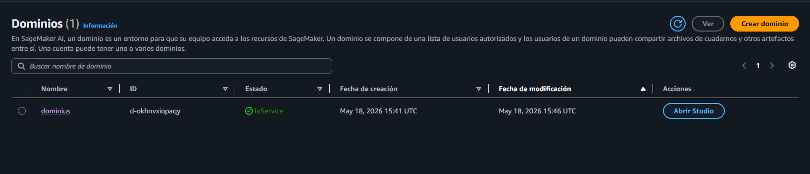

No hace falta crear ningún bucket de S3 a mano: el propio SageMaker lo coge y sube las cosas automáticamente a un bucket por defecto, y luego le pasa esa ruta de S3 al Processing Job.

Creo una instancia para entrar a JupyterLab.

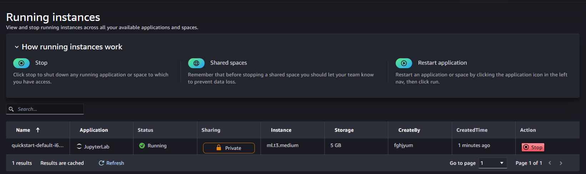

Desde ahí entro a la interfaz, que funciona casi como un VS Code.

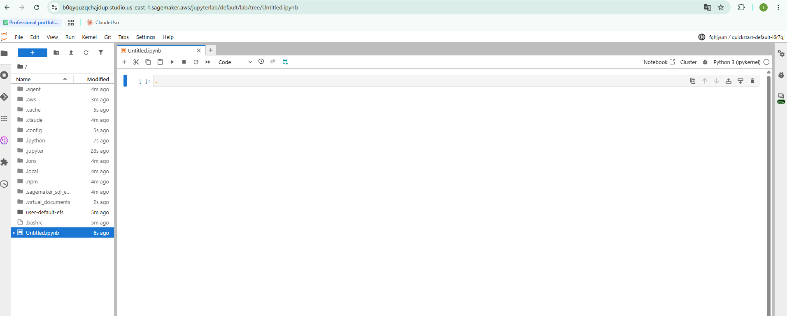

Cargo el notebook, el `.py` y el dataset.

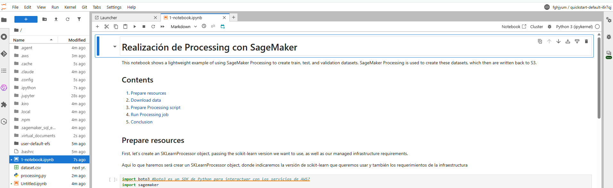

El notebook estaba escrito para una versión antigua de SageMaker y daba errores. Para igualar la versión ejecuto al inicio:

```
%pip install "sagemaker<3" --quiet
```

Cuando el job arranca, lo que hace es: levantar una instancia `ml.m5.xlarge`, descargar la imagen del contenedor de scikit-learn 1.2-1, copiar `processing.py` y el `dataset.csv` dentro, ejecutar el script, subir los outputs (`train`, `validation`, `test`) a las rutas de S3 y apagar la instancia.

En S3 se ve cómo va creando los buckets. En uno está `processing.py` y por otro lado el `dataset.csv`.

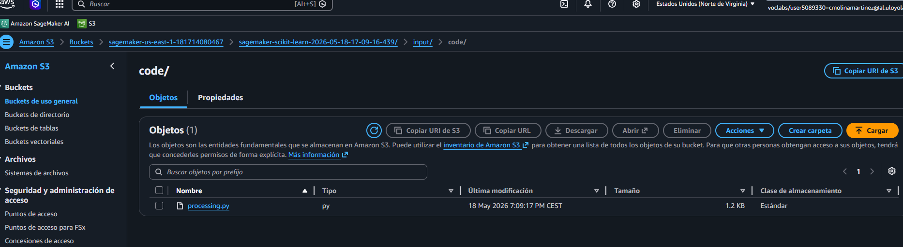

Y por otro lado se ve cómo guarda el resultado del procesado en tres sitios distintos.

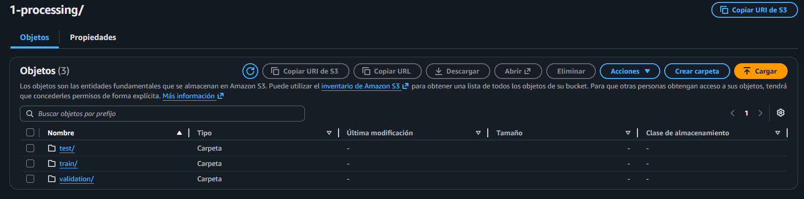

Por ejemplo, entrando a `train`:

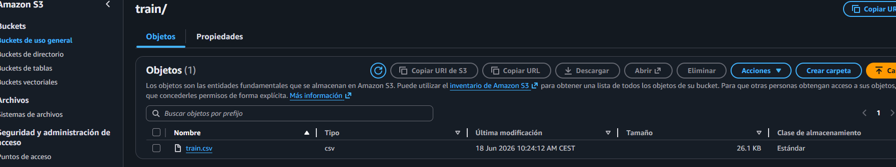

El processing job se completa con éxito.

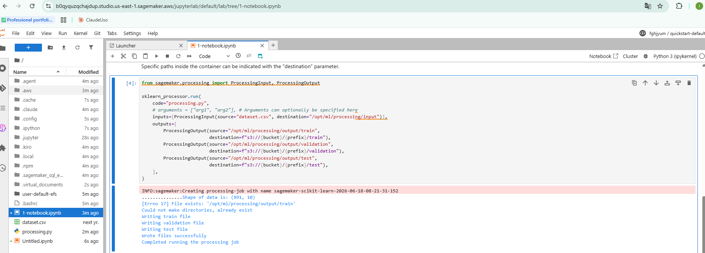

## Fase 2 · Training job (built-in XGBoost)

Elegí el algoritmo built-in de SageMaker, que usa contenedores ya preprogramados con algoritmos clásicos. La otra opción era un script personalizado, que habría sido replicar lo que ya hice en el procesamiento, así que me decanté por el built-in para ver cómo se monta este tipo de job.

Para usar XGBoost built-in hay un requisito en el formato del dataset: no puede tener cabecera (sin fila de nombres de columnas), no puede tener índices y la variable objetivo tiene que estar estrictamente en la primera columna. Por eso existe `processing_buit-in.py`, una versión del script de procesamiento que reordena `Survived` a la primera columna y guarda los CSV con `header=False` e `index=False`. Reejecuto el processing job con esta versión y obtengo los nuevos CSV.

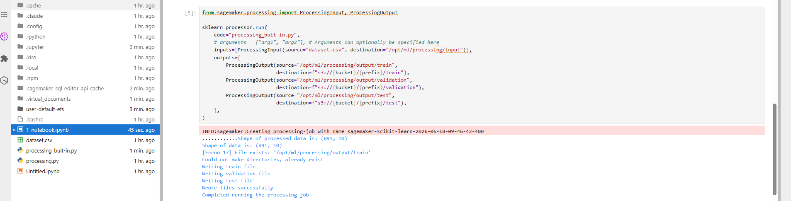

El notebook de entrenamiento que venía dado usaba built-in XGBoost, pero no estaba conectado con la salida del processing: dependía de que copiaras o subieras los CSV a mano. Lo modifiqué para que lea directamente lo que el processing job dejó en S3, de forma que el entrenamiento se nutra de esos CSV sin pasos manuales.

Sobre eso hice dos mejoras:

1. Que XGBoost use la métrica `auc` (área bajo la curva) para decidir si el modelo está mejorando. Va bien para clasificación binaria.
2. Early stopping: si durante 10 rondas seguidas la métrica de validación no mejora, el entrenamiento se para antes de llegar al máximo de épocas. Evita sobreentrenamiento y ahorra tiempo y coste de cómputo.

Esta vez el job no dio problemas al arrancar. Probablemente porque en el kernel ya constaba como ejecutado `%pip install "sagemaker<3" --quiet`. Cuidado con esto: si se reinicia el kernel y se ejecuta el notebook de training sin haber pasado antes por el de processing, puede dar error.

La salida del entrenamiento:

```
[39]    train-auc:0.91498    validation-auc:0.80470

Training seconds: 105
Billable seconds: 105
```

El modelo queda con un validation-auc de aproximadamente 0.81 y un train-auc de aproximadamente 0.91. SageMaker indica que ha sido facturable por 105 segundos. Que aparezca `auc` en el log confirma que la métrica quedó bien configurada.

En el bucket de S3 se ve también el modelo almacenado.

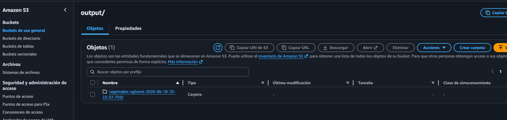

## Fase 3 · Deploy y evaluación

Creo un endpoint para hacer deploy del modelo y evaluarlo. Levanta una instancia y deja un servicio HTTP corriendo, escuchando peticiones de inferencia.

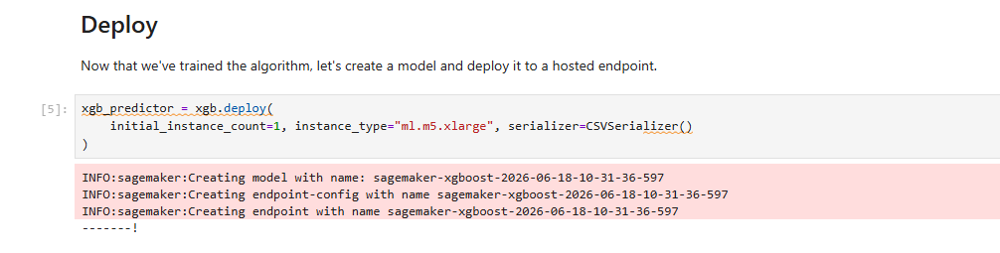

Las predicciones salen correctamente.

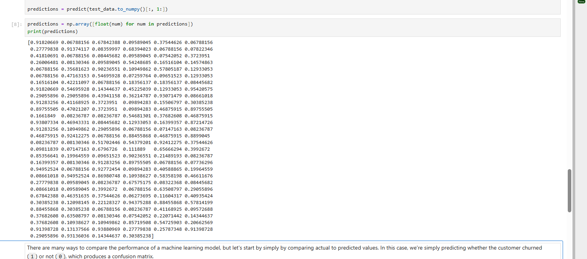

Y obtengo la matriz de confusión sobre el conjunto de test (178 casos): 108 verdaderos negativos, 7 falsos positivos, 20 falsos negativos y 43 verdaderos positivos. Eso da en torno a un 85 % de acierto.

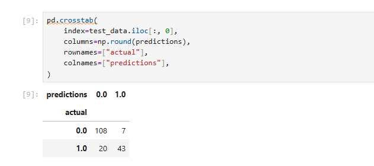

Con esto se cumplen los objetivos del lab. Por último, cierro el endpoint: si no, seguiría consumiendo recursos y facturando.

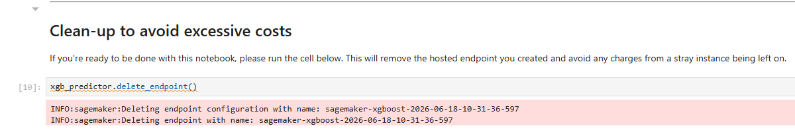

## Decisiones de diseño / criterio MLOps

**Data leakage en la imputación.** La primera versión del procesamiento imputaba la mediana de `Age` y la moda de `Embarked` usando el dataset entero, y solo después hacía el split. Eso filtra información de validation y test hacia el entrenamiento, porque esos estadísticos ya "han visto" datos que el modelo no debería conocer. Lo corregí en `processing.py`: primero hago el split y calculo la mediana y la moda únicamente sobre train; luego aplico esos mismos valores a validation y test. El one-hot encoding lo hago por subset y reindexo validation y test a las columnas de train para que no se descuadren.

**Reproducibilidad.** En `processing.py` fijo `random_state=42` en los dos `train_test_split`, así la partición sale igual cada vez que se ejecuta el job.

**Control de coste.** Las instancias del processing job se apagan solas al terminar. El early stopping del entrenamiento evita seguir gastando cómputo cuando el modelo ya no mejora. Y el endpoint hay que cerrarlo manualmente al acabar, porque mientras está vivo sigue facturando aunque no se use.
